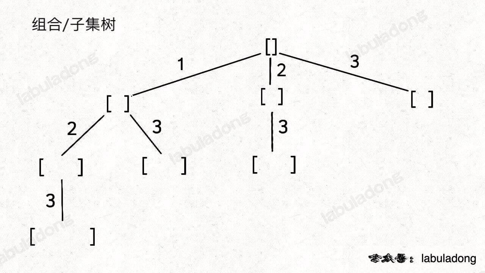

Back Track Skill

回溯是方案是一种穷举方案，它的线头是 「排列」， 「子集」， 「子序列」， 这类的暴力破解方案，对应的也是，"决策"方案的思想，
to be or not to be. 没有明显的思路的时候，想一下决策是不是可行，而决策的线头可以看作是找到属于你自己的决策树，like this 

主要感觉就是从 empty [] 出发，选择你要的数据进来，然后看是不是满足对应的条件，思路很简单，但是有一些 core cases 需要处理
1. visited map 的正确使用， 他解决排序情况下，**相邻的**兄弟节点不重选的方案
2. 在整个兄弟节点不重选的情况，也即是在决策树的层序下，某一层的数据不重复，需要在 back track 里面的for 循环外面 加上map
