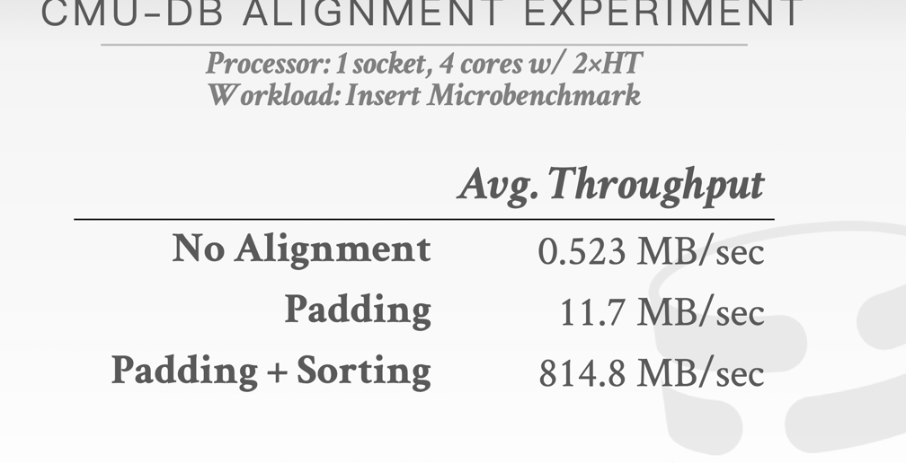
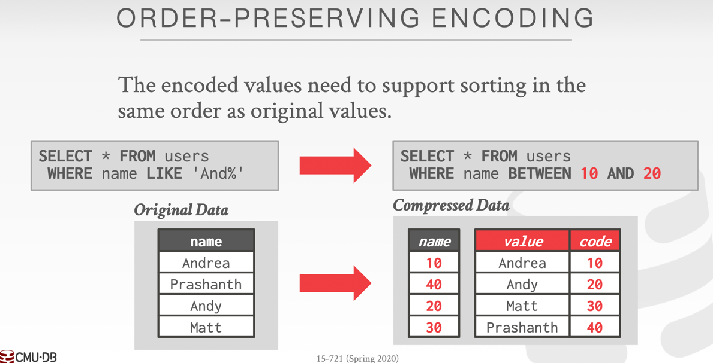

Here are Advanced skills for database

T O P I C S

1. [ ]  Concurrency Control
2. [ ] 
3. [ ]  Indexing
4. [ ] 
5. [ ]  Storage Models, Compression
6. [ ] 
7. [ ]  Parallel Join Algorithms
8. [ ] 
9. [ ]  Networking Protocols
10. [ ] 
11. [ ]  Logging & Recovery Methods
12. [ ] 
13. [ ]  Query Optimization, Execution, Compilation

Latch VS LOCK
LOCK basically a txn level which has high level in database 
it can make logical stuff during time and make for txn rollback

Latch is as short as he can 
implementation: 
1/BLOCKING OS mutex(std::mutex-> p_thread_mutex(futex=), os latch and userspace latch combination) 
2/Test And Set Spin Latch (std::atomic<T>, cpu non-friendly and os non-friendly)
3/Read And Write Latch (read / write queue and counters)


B+/Bw/palm tree concurrent control protocol implementation:
```sql
read op: 
    
    
```

```sql
write op: 
```


SESSION:Storage model & data layout
SESSION architecture:
1. [x] Type Representation(basic data type: bit, char, int, var, float, double, decimal)
2. [x] Data Layout / Alignment (padding/reorder padding)
3. [x] Storage Models(row/col/hy)
4. [x] System Catalogs

data layout:
main idea : make variable data to fixed-length data
(java data layout? )

engine will do stuff:
make table format to cpu cache friendly . do once read to access a field . to match pysical layout
    [1]padding [2] reorder the padding  
 

Storage model: 
   [1] NSM(row-based)

   [2] DSM(column-based) 
   
   [3]hybrid(read in DSM, and txn in NSM, so data will migrate to DSM)
        (two engine: may txn data in NSM copied to DSM with 2pc sync protocal... , may migrate data to DSM)
        (one engine to deal with cold/hot data)) 

    most for OLAP(colum, DSM: decomposition storage model) decisions:
    1/update policy
    2/buffering location

Catalog: ddl and cost-base info

SESSION: database compression
SESSION Architecture:(main standard is compression ratio and tradeoff to decision)
1.  [x] Compression Background (do I really to do ,just because compression and de-compression)
2.  [x] OLAP Columnar Compression (column)
3.  [x] OLTP Index Compression(row)

data skip
index : zone-map(agg value: max/min/count/sum/avg)

OLAP compression skill:
1/NULL VALUE : bitmap(a lot of zero) -> roaring bitmap (sparse data)
2/BOOLEAN(T/F): RLE (run-length-encoding) ({who, start, length} . may bad, but combination with bitmap)
3/delta encoding: diff array , and  incremental encoding: prefix/suffix skill
4/global dictionary: (is that worth to do ?!)
    benefit:fast range query for blob 

    implementation: 
          1. array (one array to store string, one array to store pointer map to string offset | expensive to update) 
          2. hashmap (fast find | unsupported range query)
          3. b+ tree(support range query and prefix | more memory)

SESSION : Recovery & Network
logging + checkpoint(make logging replay faster)
GC (epoch | time-travel(version store))

SESSION : VectorWise & Compile

SESSION : Parallel Join (Hashing && Sort-Merge && NestLoop)
SESSION Architecture:  Hash-Join && Sort-Merge Join
1. [ ] 1.hashing-join 
2. [ ] 2.sort-merge-join
3. [ ] 3.compare
4. [ ] 4.choose decision

Join decision goals:

1/Minimal Sync [No Latch]
2/Minimal Memory Access Cost 
[Ensure data is always in local work thread && Reuse data when it in cpu cache,How? 
Random-access(lookup: partition data fit cache size+TLB) OR Non-Random-access(scan: cluster data into cache line, 
do more operators)]

hash-join:
1/hash function: 
    key: fault & 
2/hash scheme
3/parallelism how ?


