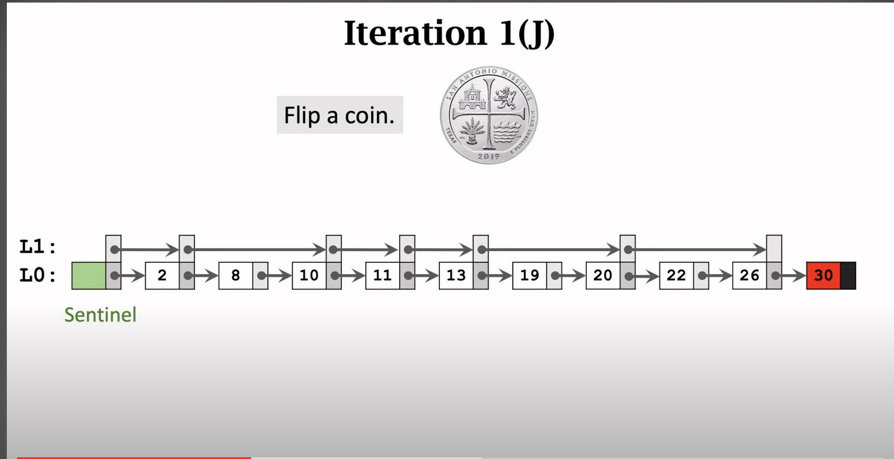
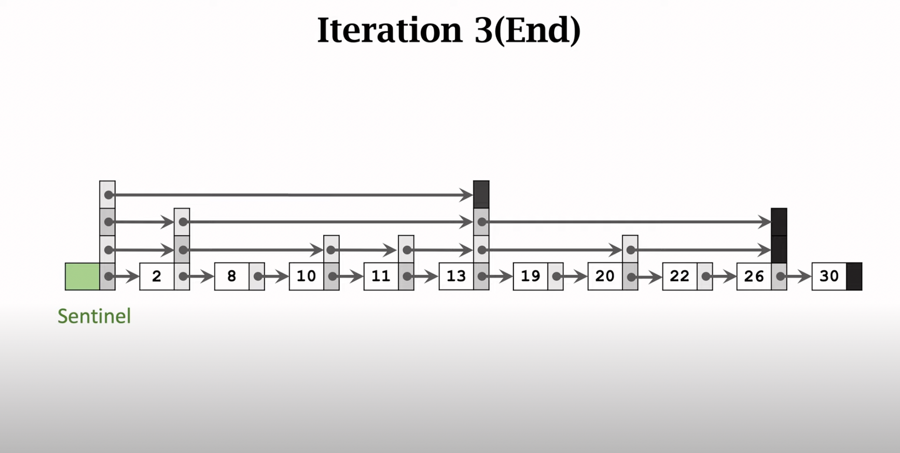

### Explore

1. how data store: Liner (array, linkedList)or Non-Liner (tree, skipList, Map...) 
2. how data explore for common sense : (binary-search...)
3. Non-Liner data store structure: (extra pointer to access other data, make explore balance in data distribution) 
    SkipList :
   1. key points: 
      1. every node has itself next pointer array to access next node ;
      2. how many next pointers dose every node has is random, which is also called level  
   2. operations:
        
      1. build:
      
      make a sentinel always maintain a pointer to first listNode in every level linkedList 
      
      every node choose itself will exist in cur level
      
      END with level has only two listNodes 
      
      
      2. search : from high level to search , if current level nodes split this whole data balanced , which time cost less
      3. insert : search first with recording first node in suitable range space from high level to 0, 
                  if 0 level does not exist this data, just insert, but if exist , insertion will choose to u,   
                  and then IMPORT STUFF is make a random for this data max level, max level is the main factor to make ur skipList balanced,
                  if I want log2(n) ,but how I should make skip steps ? why here is 2 ? 
              
      ```go
            if every node in level 0 has (1/x) to access to max level
            if I want log2(n) that means the level cnt is log2(n) , so every single node to max level should "
                (1/x) * (1/x) *...* (1/x) here are log2(n) multiplied , and level 0 has n node , so n node to must has access max level
             here goes: 
                      n * (1/x)^(log2(n)) = 1
            ==> (1/x)^(log2(n)) = 1/n 
            ==> x^(log2(n)) = n
            --> if b = log2(n) 
            ==> n = 2^b && x^b = 2^b 
            ==> x == 2
       ```
      defa        
                  every level may has (1/2)^n nodes， every node could has (1/2) chance to choose itself will exist in this level, n
                  but If I want log3(n), every level may has (1/3)^n nodes, every node could has (1/3) chance to choose itself will exist in this level.     
                  then from low level to high level 
                  to insert node with linking first node and first node's next node  
      4. delete 
   Hashing:
      maintain an array to keep index tracking for key, and value is in array, but here are many stuffs to think about
      such as array size, conflicts for key, and search time .  
      
      CuckooHashing :
   
   So may here something is simply to do : Status explore: Filter
   But something is more tricky : inverted index

4. 

