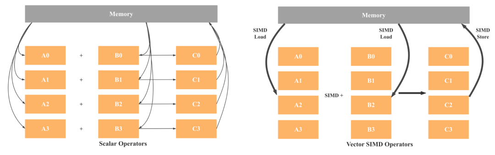

（优化篇的大体结构：优化前，利用什么优化, 优化后）

# SIMD 的 向量化的优化

SIMD（Single instruction multiple data） 是在OS 的指令编译上，
CPU 加载一个指令，但是这个指令可以处理多份数据. 那么在一个CPU 时钟周期就提高处理数据的能力, 而数据库的向量化优化一般都是基于
CPU 的优化，那CPU 的性能表现由什么可以影响呢？以及衡量CPU 的性能标准在哪里？

```go
CPU 的性能表现:
	CPU Time = Count(CPU Instruments) * CPI * Clock
(CPI = CPU Time per Instrument
具体公式：CPI = 1/4 (理想情况下的CPI) + A * K + B * L + C *M + D * N + T * MEM
A: 平均每条指令命中L2缓存的次数
B: 平均每条指令访问数据命中L2换缓存的次数
K: 指令命中L2时候的延迟
L: 数据命中L2时候的延迟
L2: 命中L2缓存的延迟(决定 K、L)
C: 平均每条指令命中L3缓存的次数
D：平均每条指令指令访问数据命中L3缓存的次数
M：指令命中L3时候的延迟
N：数据命中L3时候的延迟
T：平均每条指令和数据命中memory中的次数，也就是平均每条指令或者数据缺失L3的次数
MEM: 指令或者数据命中内存的延迟，该数据不固定，与程序访问模式相关（ras、cas都会变），影响公式的准确性
)
(Clock = CPU 一个周期的时间)
```

优化前：
cpu 的 工作流程:


简单来说分四个steps:

1. load instruments
2. decode instruments
3. carry on instruments
4. memory access (data in pipeline)
5. write back to registry

结合一个简单的累加code 

```c++
 int[] a = new int[1, 2, 3, 4];
 int[] b = new int[5, 6, 7, 8];
 int[] c; 
 for (i := 0 ; i < MAX;  ++i ) {
    c[i] = a[i]+b[i];
 }
```


### 优化前：

在以前 32 位的registry CPU 下，上面这段code 会有 4次 load a 数组数据到 registry1,  4次 load a 数组数据到 registry2，每次的load ，还会对应一次 add instrument
以及 一次 Store instrument， 总共会有16次 instruments，这就是SISD (Single Instrument Single Data)的执行方式，很简单。
但是现在的可就不一样了， registry 可以是128位，加载4个int 都可以，也就是说

### 优化后：
在一次load instrument 的过程中就可以load a[i], a[i+1], a[i+2], a[i+3] 到一个 registry， 同理b 也如此，然后在一个 Add instrument下
执行多个数据的累加，一次 Store instrument 写回多个累加和，就是说，这就直接只有一次 load a，一次 load b， 一次 Add, 一次 Store 总共4次instrument，对应上面的CPU time
就直接减少了4倍的时间。而核心点就是 一次 instrument 夹带私货了多个数据。所以也是SIMD (Single Instrument Multi Data) 的来源.

### 怎么优化： 
👆 所述更多是cpu 角度去看可以这么做，但是还没有落地，也就说，怎么让CPU 做到SIMD ，其实就在于我们高级语言如何翻译成对应的指令集，
CPU 在不同的OS 会有不同的指令集，比如windows 常见的X86，c++ 这等高级语言是需要 compiler 编译成对应的 CPU 可以执行的指令集的。

**_所以SSE、AVX 等 SIMD（Single Instruction Multiple Data）指令集就是用来实现一条指令对多个操作数的运算。
SSE 是一个系列， 包括从最初的 SSE 到最新的 SSE4.2，支持同时操作 16 bytes 的数据，即 4 个 float 或者 2 个 double。
AVX 也是一个系列，它是 SSE 的升级版，支持同时操作 32 bytes 的数据，即 8 个 float 或者 4 个 double。_**

当然compiler 的角色也很重要, 如果说，代码本身可以做到SIMD指令集，但是compiler 搞不出来，我们的c++ 
也就捉襟见肘了，比如我们举个🌰

```c++
void func(int *x, int *y, int *z) { // z , x , y 可能在同一个内存地址，比如我们调用的时候，传入同一个数组
 for (i := 0 ; i < MAX;  ++i ) {
    z[i] = x[i]+y[i];
 }
}
```
**_（这里墙列推荐一款在线的 compiler
https://godbolt.org/）_**

z , x , y 可能在同一个内存地址，比如我们调用的时候，传入同一个数组, compiler 就不会编译成一个指令后面携带多个数据的模式，原因是因为可能
会存在数据依赖，那CPU 是如何判定什么是数据依赖？大方向是在循环过程中，对于同一个变量的既有写又有读的可能，那么这个循坏变不可以被并行扩展，写过
多线程的程序盆友应该知道，读写并发带来的结果是未知的，那么 compiler 也是知道的, 在上面的代码中，compiler 认为 i 和 i+1 两次循环中
第 i 次循环会有累加结果写z[i] 和 i+1 循环会读取x[i+1] ，但是如果他们是同一个内存地址，那就会存在读写的并行，这是不安全的，所以就不会编译为
SIMD 指令集，这就是比较典型的 compiler 认为的数据依赖， 读的 x[i+1] 是不是依赖于上一次循环中 z[i] 的写结果？

当然code解决方案是：（中心思想都是给 compiler 更多的信息告诉他 这代码可以被编译SIMD 指令）
1. 在变量上添加 restrict key word，告诉 compiler 我们这些变量不再一个内存地址，放心，没有数据读写依赖的冲突
2. 在code 代码体中加上 pragma or hint 等操作
3. 高级玩法，直接上 AVX / SSE 指令集代码，但是移植性太差。比如_mm256_* 就是 AVX 向量指令的封装函数。_mm256_load_pd 指令用来加载操作数，_mm256_add_pd
加法运算啥的。

此外还有一种场景，是内存对齐带来的 SIMD 加速，这个优化其实在代码中可以有很多地方可以改，从而提升整体的程序性能，因为CPU 执行取数据的指令，是一次
取数据总线宽度大小的数据，如果在内存中，数据没有按照地址对齐，那么会导致，多次的内存访问，从而无法让SIMD 发挥它拥有的特性
