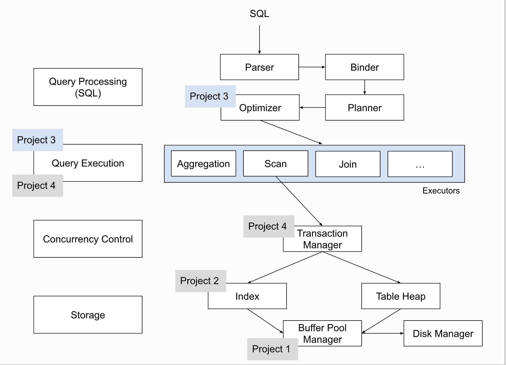
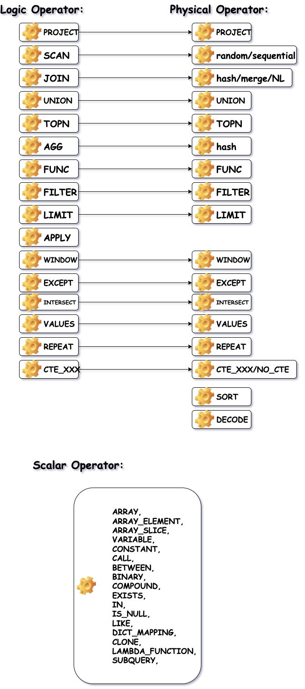
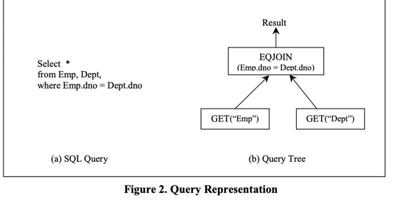
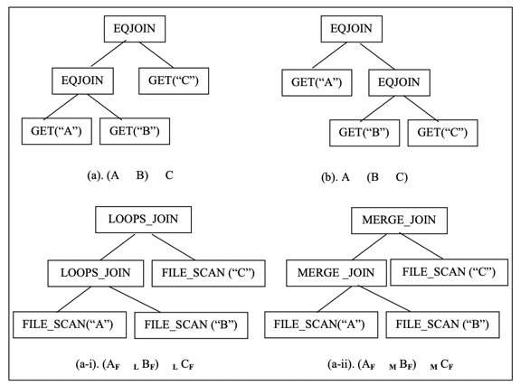
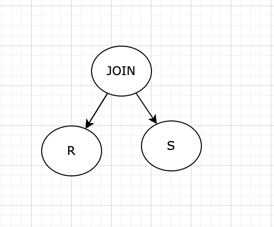
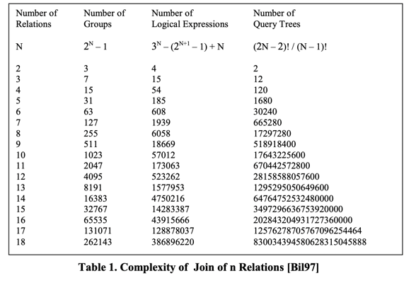
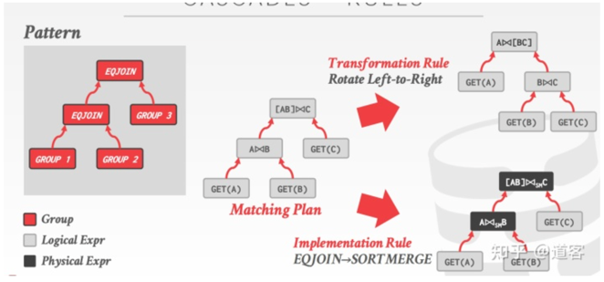
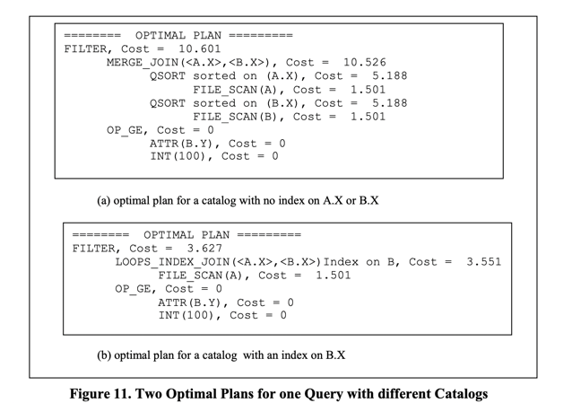

SESSION : Query Optimizer

SQL ->> QUERY-OPTIMIZER ->> PLAN(s) ->> MACHINE(multi core|mem|disk)

序：
    QUERY-OPTIMIZER 在👆的流程图可以看得出来，在数据库中扮演着 🧠 的位置，不管是OLAP， OLTP，HTAP 都会有不同实现方案，随着时间的推进，
一些优秀的思想和框架在时间的沉淀下，也慢慢占有他们的一席之地。本篇只是想以我浅薄的认知去以洞见一些优化器的本质。内容会包含算法思想，数据结构。

1. SQL 的 何去何从?:
   
   SQL 是给人看的，LogicPlan 是给 Optimizer 看的，Physical plan 是给 Executor 看的， 最后生成的机器码是给机器看的。

   大致上工业界都是让 SQL 从网络层Socket以二进制数据载体来了之后, DB 会拥有一个 SqlParser 类通过用当下比较流行的 ANTLR 插件生成对应的 Statement（ 
大体是经过 Lexer（词法解析器） , Syntactic（语法解析器） 形成一个 DB 中的类对象 Statement, eg.```SELECT * FROM test WHERE test.id = 1```  被解析完就封装到了 QueryStatement class 对象中去，
这涉及到SQL 编译原理，不展开） 同时，每一种Statement的相关语义上的check等操作，那么问题就来了，Statement 的粒度在哪？拥有了很多不同操作粒度的Statement 之后咋交给机器看执行呢？说白了就是database如何```高效```
的和OS交流，才能让OS 将存储在memory 或者 cache 或者 disk(ssd/hdd) 吐给database，进而展示给用户看。
举一个具体的场景，QueryStatement 的生成, 自己感受下 ：

ANTLR 定义 ：(当我们写的sql 语句可以通过模式匹配到👇的一些组合的话，就在代码中可以通过 Parser 得到一个QueryStatement obj)
```mysql
explainDesc
: (DESC | DESCRIBE | EXPLAIN) (LOGICAL | VERBOSE | COSTS)?
    ;

queryStatement
    : explainDesc? queryBody outfile?;
    
queryBody
: withClause? queryNoWith
    ;
    
-- #with query 是一种在query 阶段定义的一种别名视图， 原始sql可以长这样
-- #-- define CTE:
-- # WITH Cost_by_Month AS
-- # (SELECT campaign_id AS campaign,
-- #        TO_CHAR(created_date, 'YYYY-MM') AS month,
-- #        SUM(cost) AS monthly_cost
-- # FROM marketing
-- # WHERE created_date BETWEEN NOW() - INTERVAL '3 MONTH' AND NOW()
-- # GROUP BY 1, 2
-- # ORDER BY 1, 2)
-- # 
-- # -- use CTE in subsequent query:
-- # SELECT campaign, avg(monthly_cost) as "Avg Monthly Cost"
-- # FROM Cost_by_Month
-- # GROUP BY campaign
-- # ORDER BY campaign
    
withClause
: WITH commonTableExpression (',' commonTableExpression)*
    ;

queryNoWith
:queryTerm (ORDER BY sortItem (',' sortItem)*)? (limitElement)?
    ;

queryTerm
: queryPrimary                                                             #queryTermDefault
| left=queryTerm operator=INTERSECT setQuantifier? right=queryTerm         #setOperation
| left=queryTerm operator=(UNION | EXCEPT | MINUS)
    setQuantifier? right=queryTerm                                         #setOperation
;

queryPrimary
: querySpecification                           #queryPrimaryDefault
| subquery                                     #subqueryPrimary
;

outfile
: INTO OUTFILE file=string fileFormat? properties?
    ;
```
```javascript
// parse to build query statement 
public ParseNode visitQueryStatement(StarRocksParser.QueryStatementContext context) {
    QueryRelation queryRelation = (QueryRelation) visit(context.queryBody());
    QueryStatement queryStatement = new QueryStatement(queryRelation);
    if (context.outfile() != null) {
        queryStatement.setOutFileClause((OutFileClause) visit(context.outfile()));
    }

    if (context.explainDesc() != null) {
        queryStatement.setIsExplain(true, getExplainType(context.explainDesc()));
    }

    return queryStatement;
}


public class QueryStatement extends StatementBase {
    private final QueryRelation queryRelation;

    // represent the "INTO OUTFILE" clause
    protected OutFileClause outFileClause;

    public QueryStatement(QueryRelation queryRelation) {
        this.queryRelation = queryRelation;
    }
```

   
2. best ExecPlan (maybe ?!)的生成
      首先有必要预先普及一下一些名词，因为对于DB一些了解不深的人来说，看到一些db人常说的词汇其实会比较摸不着头脑，就当作字典的开始目录吧，其次我会针对StarRocks 的source-code 进行一些概念的解读，
   用于参照工业界的OLAP Optimizer 的实现
      ```sql
      Tuple : wiki 上解释为从字段名到特定值的有限元素序列,eg. (name: amory, age: 25, cute: true) 作为一个tuple:表示25岁且可爱的amory 
      Relation Algebra(关系代数) : a set of fundamental operations to retrieve and manipulate tuples (检索和管理tuples 的一组操作集合)  
      
      Operator:(一种运算方式,关系代数的算子：https://zh.wikipedia.org/wiki/%E5%85%B3%E7%B3%BB%E4%BB%A3%E6%95%B0_(%E6%95%B0%E6%8D%AE%E5%BA%93))
       大体上我们常见分类有：
               "集合运算"：并集，差集，并集，笛卡尔积
               "投影 (π)"
               "选择 (σ)"
               "重命名 (ρ)"
               "自然连接 (⋈)": 两个关系的元组，组合条件是简单的共享属性上的相等
               "θ-连接和相等连接"：两个关系的元组，组合条件不是简单的共享属性上的相等，有< , <>
               "半连接 (⋉)(⋊)": 半连接的结果只是在S中有在公共属性名字上相等的元组所有的R中的元组
               "反连接 (▷)": 反连接的结果是在S中没有在公共属性名字上相等的元组的R中的那些元组。
               "左外连接 (⟕) | 右外连接 (⟖) | 全外连接 (⟗)"
               "聚集运算": AGG, MAX...
               "标量运算": 标量函数将标量值（如整数或字符串）用作参数，并返回标量值作为结果。 可在 SQL 中任意可以传递标量值的地方使用标量函数, 如EXISTS, IN ...

      ```
      StarRocks 中定义的Operator , 大致有👇
      
        physical Op 是对于 logical Op 的一种具体算法的的实现， 比如 logical join 的 physical 实现有sort merge join 或者 hash join

```Query Tree: 至少包含一个logical operator 的查询计划树,他可以长这样```

```sql
 Execution plan: 通过一个具体的物理算子实现 query tree 上的 logical op的计划
```

```sql
    其实可以看到不管是 querytree 还是 execution plan 都是一种抽象的树，一个node + inputs(children),所以我们使用一个Expression
    Expression: 关系代数的表达式，包括Operator 和 这个Operator 的 inputs(也就是tree 的children)
```
StarRocks 中 OptExpression class 就是Expression 的表示
```javascript
/**
 * An expression is an operator with zero or more input expressions.
 * We refer to an expression as logical or physical
 * based on the type of its operator.
 * <p>
 * Logical Expression: (A ⨝ B) ⨝ C
 * Physical Expression: (AF ⨝HJ BF) ⨝NLJ CF
 */
public class OptExpression {
    // Expression 拥有的两个概念
    private Operator op;
    private List<OptExpression> inputs;
    
    //public class LogicalProperty {
        // Operator's output columns
        // private ColumnRefSet outputColumns;
        // The tablets num of left most scan node
        // private int leftMostScanTabletsNum;
        // The flag for execute upon less than or equal one tablet
        // private boolean isExecuteInOneTablet;
        //} // 保存一些当前operator 需要输出列的信息， 后面两个是后续算法优化需要的一些标志和额外信息
    
    private LogicalProperty property;
    private Statistics statistics;
    private double cost = 0;
    // The number of plans in the entire search space，this parameter is valid only when cbo_use_nth_exec_plan configured.
    // Default value is 0
    private int planCount = 0;
}
```
```sql  
不过新的问题很快就来了 (A ⨝ B) ⨝ C 和 (B ⨝ A) ⨝ C 这两个 OptExpression 看着它两 不相似莫
如果这两个logical OptExpression 的输出结果是一样的，那我们从逻辑上就判断他们是相等的，相等的OptExpression 用同一个表达式表示就是Group 
Group: logically equivalent expressions 
    就拿👆的两个OptExpression 举例，
    (A ⨝ B) 和 (B ⨝ A) 可以被归类到 [AB] Group 中
    ([AB] ⨝ C) 可以被归类到[ABC] Group 中
    其实就是把特定的排列，通过逻辑上的判断相同的排列们收集成一个组合， 这样做的收益可以多想想看
    
那其实我们发现有一个([AB] ⨝ C) 表达式就会产出，拥有一些group 同时又有算子，看起来和 OptExpression 就很相似，我们把它定义为Muti-Expression
Multi 代表group 里面会有multi optExpression
```
StarRocks 中 Group class 就是定义Group
StarRocks 中 GroupExpression class 就是在定义 MultiExpression
```javascript
 //A group is a set of logically equivalent logical and
//   physical expressions that produce the same output.
public class Group {
    private final int id;
    private final List<GroupExpression> logicalExpressions;
    private final List<GroupExpression> physicalExpressions;
    
}

public class GroupExpression {
    // The group this group expression belong to,
    // will set by setGroup method
    private Group group;
    private final List<Group> inputs;
    private final Operator op;
}
```

关于这几个比较绕的概念我举个🌰，自己感受下
Group : [RS] 为了简化 [R⨝S] 和 [S⨝R]
GroupExpression : ([RS]⨝T) ，
所以GroupExpression 类里面拥有一个成员变量Group,  表示 ([RS]⨝T) 这个GroupExpression是属于 Group [RST]的
 
中间状态还是蛮容易表示的，初始状态下，一般来说，Group == Group Expression == OptExpress (R)
在这里可以计算简单的计算一个小小的题，对于Join来说，table 的数量 N ，和group 的数量对应是多少？如果你能回答上来是 2^N-1 那就说明你懂了,
因为其实就是在计算

这样一个树结构的节点个数，👇是一些数据供参考。


那会有个问题，怎么将一个GroupExpression 变成 一个逻辑上可以相等的 例外一个 GroupExpression ? 很明显我们需要一个Rule ，用rule去匹配，其实就是一种模式匹配。
事先定义好一些pattern, 满足我这个pattern的就可以使用这个rule做transformation。

```sql
Rule : GroupExpression(Logical/Physical) <==> GroupExpression(Logical/Physical)
    也可以看到GroupExpression 分logic 和 physical ，转变的时候apply 的rule 可能不大相似的，为了明确转换的时候，我可以从那种rule 找，简单的
        给Rule 分个类把
        
Rule-Pattern: 每一个Rule 应该长啥样，能匹配输入的Expression  
```
StarRocks 中 Rule 相关的定义⬇️
```javascript
public enum RuleSetType {
    // logical expression <==> logical expression
    LOGICAL_TRANSFORMATION,
    // logical expression <==> physical expression
    PHYSICAL_IMPLEMENTATION,
    
    // optimial rule definations to rewrite expression 
    MERGE_LIMIT,
    PRUNE_COLUMNS,
    PARTITION_PRUNE,
    PUSH_DOWN_PREDICATE,
    SUBQUERY_REWRITE,
    PUSH_DOWN_SUBQUERY,
    PRUNE_ASSERT_ROW,
    MULTI_DISTINCT_REWRITE,
    AGGREGATE_REWRITE,
    PRUNE_SET_OPERATOR,
    PRUNE_PROJECT,
    COLLECT_CTE,
    INLINE_CTE,
}
// Rule 的抽象
public abstract class Rule {
    private final RuleType type;
    private final Pattern pattern;
    
    public abstract List<OptExpression> transform(OptExpression input, OptimizerContext context);
}

// RuleSet 定义static func ，启动之后就加载Rule在JVM中
public class RuleSet {
    // rewrite rule: extend tree 
    private static final Map<RuleSetType, List<Rule>> REWRITE_RULES = Maps.newHashMap();

    // implemention rule:  logical expression <==> physical expression
    private static final List<Rule> ALL_IMPLEMENT_RULES = ImmutableList.of(
        new OlapScanImplementationRule(),
        new HudiScanImplementationRule(),
        new SchemaScanImplementationRule(),
        new MysqlScanImplementationRule(),
        new HashAggImplementationRule(),
        new ProjectImplementationRule(),
        new TopNImplementationRule(),
        new AssertOneRowImplementationRule(),
        new WindowImplementationRule(),
        new UnionImplementationRule(),
        new ExceptImplementationRule(),
        new IntersectImplementationRule(),
        new ValuesImplementationRule(),
        new RepeatImplementationRule(),
        new FilterImplementationRule(),
        new TableFunctionImplementationRule(),
        new LimitImplementationRule(),
        new CTEProduceImplementationRule()
            ...
    );

    private final List<Rule> implementRules = Lists.newArrayList(ALL_IMPLEMENT_RULES);

    private final List<Rule> transformRules = Lists.newArrayList();

    static {
        REWRITE_RULES.put(RuleSetType.MERGE_LIMIT, ImmutableList.of(
            new MergeLimitWithSortRule(),
            new PushDownLimitJoinRule(),
            new MergeLimitWithLimitRule(),
            PushDownLimitDirectRule.PROJECT,
            PushDownLimitDirectRule.ASSERT_ONE_ROW,
            PushDownLimitDirectRule.CTE_CONSUME,
            MergeLimitDirectRule.AGGREGATE,
            MergeLimitDirectRule.OLAP_SCAN,
            MergeLimitDirectRule.HUDI_SCAN,
            MergeLimitDirectRule.SCHEMA_SCAN,
            MergeLimitDirectRule.ES_SCAN,
            MergeLimitDirectRule.WINDOW,
            MergeLimitDirectRule.INTERSECT,
            MergeLimitDirectRule.EXCEPT,
            MergeLimitDirectRule.VALUES,
            MergeLimitDirectRule.FILTER,
            MergeLimitDirectRule.TABLE_FUNCTION
                ...
        ));

        REWRITE_RULES.put(RuleSetType.PARTITION_PRUNE, ImmutableList.of(
            new PartitionPruneRule(),
            new DistributionPruneRule(),
            RemoteScanPartitionPruneRule.HIVE_SCAN,
            RemoteScanPartitionPruneRule.ICEBERG_SCAN,
            PushDownMinMaxConjunctsRule.HIVE_SCAN,
            PushDownMinMaxConjunctsRule.HUDI_SCAN,
            PushDownMinMaxConjunctsRule.ICEBERG_SCAN,
            ...
        ));

        // 基本上👆RuleSetType 都有一系列的RuleSet class 
}


/**
 * Pattern is used in rules as a placeholder for group
 */
public class Pattern {
    private final OperatorType opType;
    private final List<Pattern> children;
}
```


这里埋下一个伏笔，给定一个OptExpression ，如果再给多个pattern ，会不会有多个 OptExpression 输出？(这里涉及到的算法是两棵树的匹配原则，所以树的算法还是很重要的，理解代码会比较容易些)
就比如：
```javascript
 /*
     * Example:
     *        JOIN(j)        (Group...)
     *        /    \
     *    SCAN      SCAN     (Group...)
     *   /  |  \    /    \
     *  a   b  c   d      e  (GroupExpressions...)
     *
     * Pattern:
     *      JON
     *     /   \
     * SCAN     SCAN
     *
     * will match first: jad
     * next: jae, jbd, jbe....
     */

简化出来的算法模型就是给你两颗树， groupExpression 和 pattern 树，能输出多少个match 的子树？
```


那其实讲到这里，我们发现我们原始的query tree 变成 OptExpression 之后通过match rule pattern  可以做很多等价转换，同时也可以做
rewrite，但是真正的目的还没开始呢，我们要找到一个"最优"的 exec plan(执行计划，或者上文提到的物理表达式physical expression) 呢。
最优问题？是不是能勾起coder 关于dp，backtrack，greedy啥的一些神经？其实把问题简化成算法题也就是怎么从一组复杂的 exec plan 中选出最优的 exec plan
既然说到最优，那最优的标准是什么？怎么衡量这个 exec plan？
做法还是挺多的，业界比较标准判断是对于每个算子Operator 计算它的cpu占有时间，内存使用情况，和网络io

比如StarRocks 
```javascript
public class CostEstimate {
    private final double cpuCost;
    private final double memoryCost;
    private final double networkCost;
    private static final CostEstimate ZERO = new CostEstimate(0, 0, 0);
}
```
那有了因素，需要思考如何给这些因素进行加权，获得一个相对比较标准的结果。
```javascript
    // 基本上是这样的比例，至于说为什么，因为
    public static double getRealCost(CostEstimate costEstimate) {
        double cpuCostWeight = 0.5;
        double memoryCostWeight = 2;
        double networkCostWeight = 1.5;
        return costEstimate.getCpuCost() * cpuCostWeight +
                costEstimate.getMemoryCost() * memoryCostWeight +
                costEstimate.getNetworkCost() * networkCostWeight;
    }
```

关于cost 计算其实又是一个比较大的话题，也是比较重要的因素，因为它直接能判断一个计划好不好，但是它又有很大局限性，比如没有考虑算子之间的相关性，具体可以看👇的一个思考。
```sql
DB:automobiles:→ 
    TABLE Makes 有 10 个
    TABLE Models 有 100 个
    
Following query:→ (make="Honda" AND model="Accord")
假设查询Operator 之间独立 没有相关行: 
the selectivity is: scan(makes) * scan(models)
    1/10 × 1/100 = 0.001
但是如果Models 中 Accord 对应的 make 只有 Honda 
那 selectivity is 1/100 = 0.01
```
关于cost model的具体计算方案，给自己留个坑以后将，本篇还是主力讲一下整体查询优化的过程和工业界的实践吧.👇简单给一个粗粒度的optimal plan的cost 样子打打版


现在我们或多或少拥有一些 expression，那我们第一步得找个数据结构(公共的空间)存下来吧，这个空间我们叫做 Search Space, 在StarRocks 中用 Memo class 定义
```javascript
public class Memo {
    private int nextGroupId = 0;
    // The group id is same with the group index in groups List
    private final List<Group> groups;
    private Group rootGroup;
    /**
     * The map value is root group id for the GroupExpression.
     * We need to store group id because when {@see insertGroupExpression}
     * we need to get existed group id for tmp GroupExpression,
     * which doesn't have group id info
     */
    private final Map<GroupExpression, GroupExpression> groupExpressions;
}
```
写过dp 的人应该对memo 都有所了解吧，算法的结果缓存。 有了memo 其实就能更好的做group pruning


众说周知，人与人说话都是一门艺术，嫁接到database，他与os 交流也是一门艺术哈哈哈（有点扩展了）

