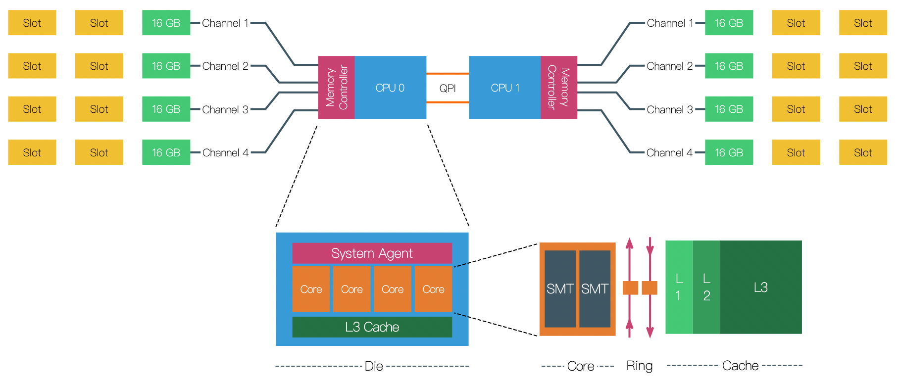

芯片 => output a die


die == multi core


实际上


CPU （一个cpu 可以有多个die，也可以有一个die）：多个core加上L3等组成一个Die：一个core 有L1, L2 cache



Cache


Physical-CPU : (用于获取机器实际物理cpu 个数)
```cgo
root@d1:~# cat /proc/cpuinfo | grep "physical id" | sort | uniq | wc -l
1
```
Logical-CPU = Physical-CPU's count * each Physical-CPU's core count * each Physical-CPU's each core 的超线程数

Physical-CPU core count : (用于获取物理CPU上的core 数 or 一个socket 有 8 个 core)
```cgo
root@d1:~# cat /proc/cpuinfo | grep "cpu cores" | uniq
cpu cores	: 8
```
Logical-CPU processor count: (用于获取逻辑CPU 的processor 数)
```cgo
root@d1:~# cat /proc/cpuinfo | grep "processor"
processor	: 0
processor	: 1
processor	: 2
processor	: 3
processor	: 4
processor	: 5
processor	: 6
processor	: 7
processor	: 8
processor	: 9
processor	: 10
processor	: 11
processor	: 12
processor	: 13
processor	: 14
processor	: 15
root@d1:~# cat /proc/cpuinfo | grep "processor"  | wc -l
16

root@d1:~# cat /proc/cpuinfo | grep "siblings"
siblings	: 16
siblings	: 16
siblings	: 16
siblings	: 16
siblings	: 16
siblings	: 16
siblings	: 16
siblings	: 16
siblings	: 16
siblings	: 16
siblings	: 16
siblings	: 16
siblings	: 16
siblings	: 16
siblings	: 16
siblings	: 16
root@d1:~# cat /proc/cpuinfo | grep "siblings"  | wc -l
16

```