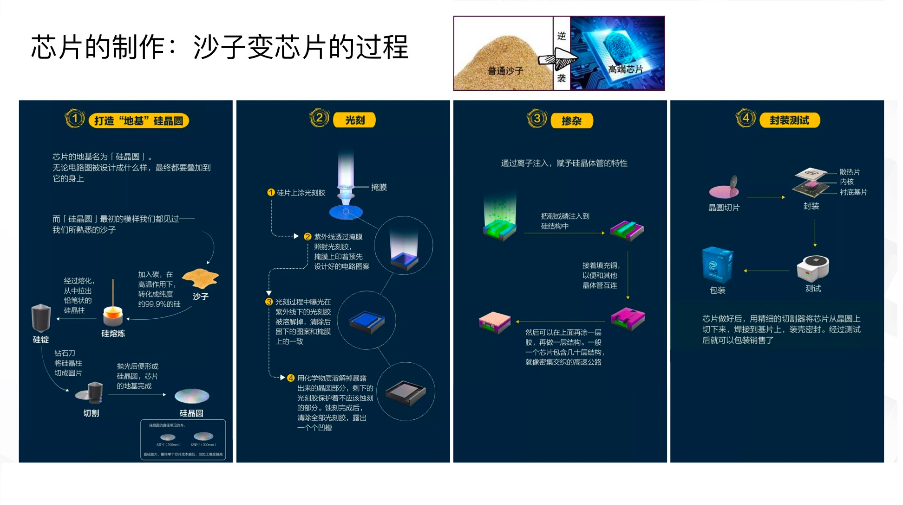
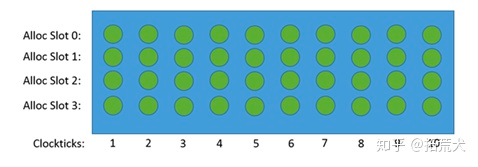
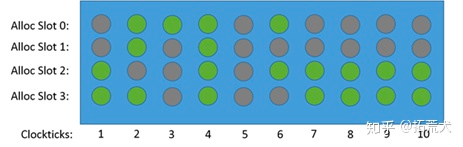

芯片 => output a die



die == multi core


实际上


CPU （一个cpu 可以有多个die，也可以有一个die）：多个core加上L3等组成一个Die：一个core 有L1, L2 cache


Cache


Physical-CPU : (用于获取机器实际物理cpu 个数)
```cgo
root@d1:~# cat /proc/cpuinfo | grep "physical id" | sort | uniq | wc -l
1
```
Logical-CPU = Physical-CPU's count * each Physical-CPU's core count * each Physical-CPU's each core 的超线程数

Physical-CPU core count : (用于获取物理CPU上的core 数 or 一个socket 有 8 个 core)
```cgo
root@d1:~# cat /proc/cpuinfo | grep "cpu cores" | uniq
cpu cores	: 8
```
Logical-CPU processor count: (用于获取逻辑CPU 的processor 数)
```cgo
root@d1:~# cat /proc/cpuinfo | grep "processor"
processor	: 0
processor	: 1
processor	: 2
processor	: 3
processor	: 4
processor	: 5
processor	: 6
processor	: 7
processor	: 8
processor	: 9
processor	: 10
processor	: 11
processor	: 12
processor	: 13
processor	: 14
processor	: 15
root@d1:~# cat /proc/cpuinfo | grep "processor"  | wc -l
16

root@d1:~# cat /proc/cpuinfo | grep "siblings"
siblings	: 16
siblings	: 16
siblings	: 16
siblings	: 16
siblings	: 16
siblings	: 16
siblings	: 16
siblings	: 16
siblings	: 16
siblings	: 16
siblings	: 16
siblings	: 16
siblings	: 16
siblings	: 16
siblings	: 16
siblings	: 16
root@d1:~# cat /proc/cpuinfo | grep "siblings"  | wc -l
16

如果👆两个结果一致，代表超线程没有开启, 如果 siblings 是 processor 的两倍代表 超线程开启
```

micro-ops (uOps): 
CPU core 每个时钟周期 一般来说可以至少译码4条指令，每条指令会产生很多小的指令，被称为micro-ops (uOps)
```cgo
Pipline Slot 是用来处理 uOps 的硬件资源, 每个 Slot 填充一个 uOps
```
👇这个图假设core 是个四发射core，也即是core的 frontend 每个时钟周期可以发送 4个 uOps 给 backend, 所以下面的每个 clocktick 上有4个slot
去填充 4个uOps， 理想状态下这里有10个时钟周期，每个周期的slot 全部被 uOps 填满

但是由于很多原因, core frontend 不会全部给 backend 每次 clocktick 都是4个uOps, 就会是👇这个状态, 灰色表示该 slot 并未被uOps所填充


CPU Microcodes: 是指嵌入在CPU芯片中的一组指令，用于控制和管理CPU的操作。这些指令是由CPU制造商编写的，通常在CPU的生产过程中被固化在芯片中，
不能被修改或更新。和 uOps 不太一样，比如
```cgo
加载指令：用于将数据从内存中加载到CPU寄存器中。执行内存读操作

存储指令：用于将CPU寄存器中的数据存储到内存中。执行内存写操作

算术指令：用于执行算术运算，例如加、减、乘、除等。

逻辑指令：用于执行逻辑运算，例如与、或、非、异或等。

分支指令：用于根据条件改变程序的执行路径。执行分支跳转操作

中断指令：用于响应外部事件，例如输入输出、时钟中断等。执行中断处理操作

浮点指令：用于执行浮点运算，例如加、减、乘、除等。

SIMD指令：用于执行向量运算，例如向量加、向量乘等。

虚拟化指令：用于实现虚拟化技术，例如虚拟机监视器等。

安全指令：用于实现安全功能，例如加密、解密等。

执行指令解码操作

执行特定的硬件操作，如 I/O 控制等。
```

频率和周期： 每秒20个循环， 一个变化循环所需要的时间就是周期，频率是周期的倒数
```
一个周期是 0.05s，那频率就是 1/0.05 = 20 Hz, 频率的单位是Hz
那么按 时间1s 计算：
会有20个周期，也就是20Hz
``` 
然后对应CPU有两个周期，指令周期 VS 时钟周期
```cgo
intruction cycle (指令周期) ： 取指 到 执行完指令的时间
clock cycle (时钟周期) : 处理 operation 的时间
很明显: intruction cycle >> clock cycle 
一个 intruction cycle 至少是两个 cpu cycle，fetch and carray-on, (稍微完整一点：fetch and decode and carry-on and write-back)
每个 cpu cycle 又是很多的 operation 的组合，所以是很多 clock cycle   

比如：x86 指令
adc [rdi] 1   =======>  clock cycle :8  ======> intruction cycle : 1
```

CPU context == CPU registry + 程序计数器
```cgo
CPU context switch ( CPU 上下文切换) ： CPU 保存当前任务的registry和程序计数器，加载 另外一个任务的上下文registry 和 程序计数器，然后在
跳转到这个新加载的程序计数器的位置，执行新的任务
```
