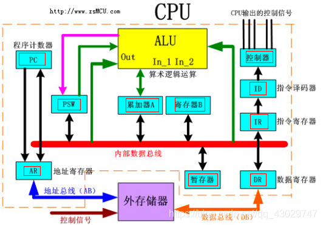
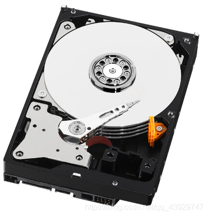
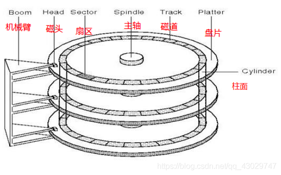
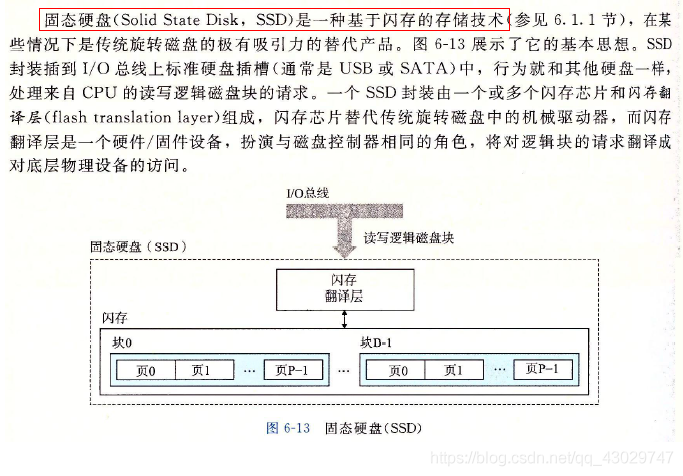
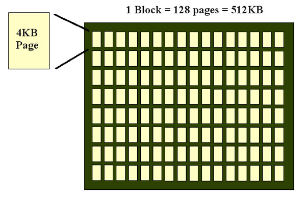
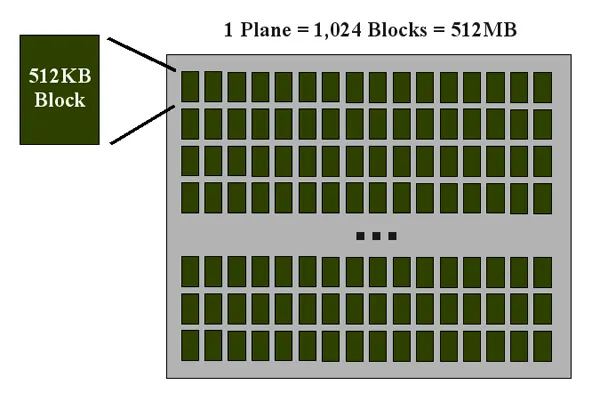
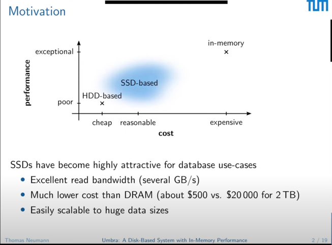
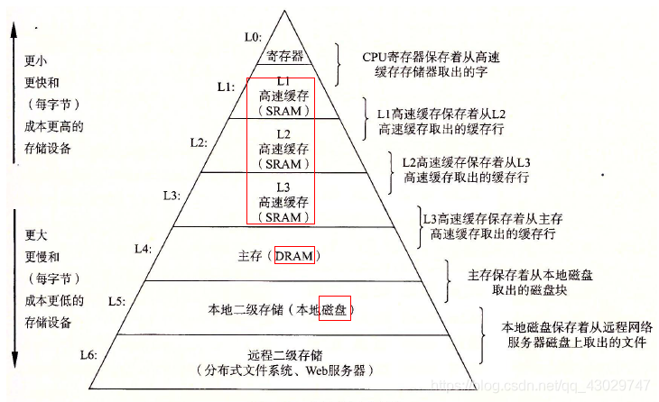

存储介质：
1. registry 在cpu 中

2. memory:  SRAM(Static Random Access Mem) / DRAM (Dynamic ...)
   SRAM 可以在主板/卡槽/集成在CPU上，DRAM 主存

3. disk : HDD / SSD / HHD

HDD : 机械硬盘，有扇区和旋转指针头

a. 盘有多个， 磁道在每个盘面有多个，扇区在每个磁道有多个

b. 磁头可以按照半径方向选择每个磁道

c. 磁头可以根据盘面的旋转选择扇区 

SSD : 固态硬盘，没有扇区，没有风扇，访问速度接近内存

a. 是闪存的一种实现方式

b. SSD 排列是由拥有多个pane(拥有多个block(拥有多个page))组成；
比例： block : page = 1:64 or 1:128 ; pane : block = 1:1024

c. 需要注意 SSD 写放大的问题
放大的写来源于两个场景，一个是 当一个block 的 剩余容量 不多的时候，需要写入新的page，但是需要擦除的是一个block，所以会将
该block上所有的 有效page 和 trim 打上标记的 无效page 通过移动擦除的方式，移到另外一个block，（java gc 标记清除），
原本写入的page， 却惊动了整个 block。 另外一个 均衡block的擦除次数，block擦除在3000～5000次左右，超过基本定成坏block,
定期对常年保持在很少擦除的block移动一下数据，来均衡比较多擦除的block. 保持一个整体的坏死率

HHD : 混合硬盘 （没啥了解）

