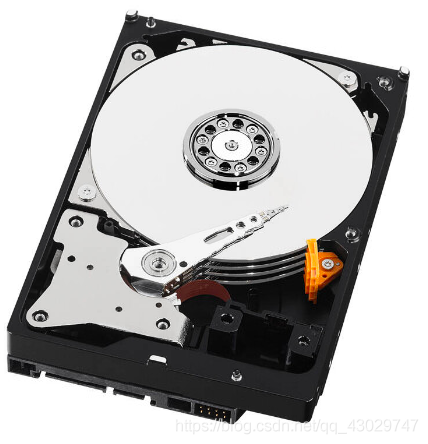
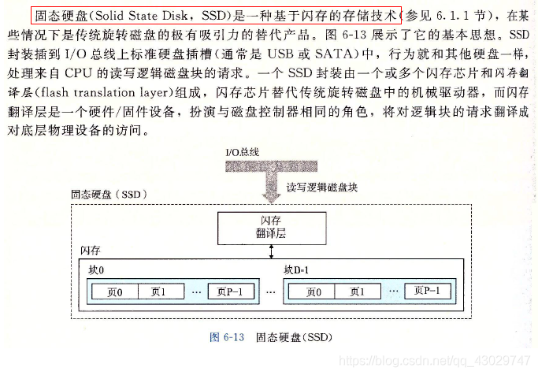
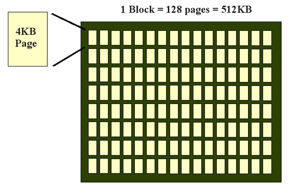
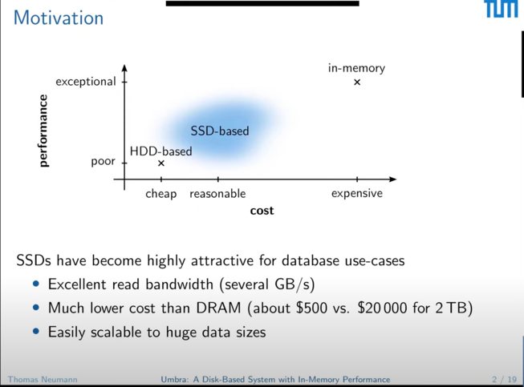
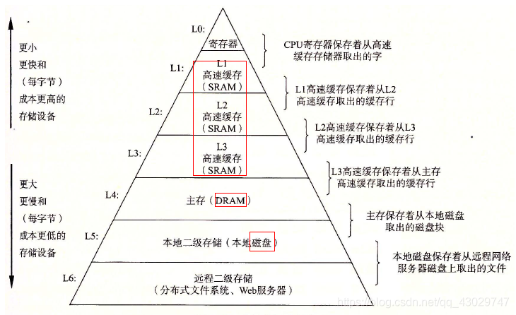

存储介质：
1. CPU registry 


* 寄存器	   16位	32位	64位
* 累加寄存器	AX	EAX	RAX
* 基址寄存器	BX	EBX	RBX
* 计数寄存器	CX	ECX	RCX
* 数据寄存器	DX	EDX	RDX
* 堆栈基指针	BP	EBP	RBP
* 变址寄存器	SI	ESI	RSI
* 堆栈顶指针	SP	ESP	RSP
* 指令寄存器	IP	EIP	RIP

关于寄存器，我们会在函数调用，计算中经常使用到，特别是c++ code -> x86 之后会变成 寄存器使用代码，掌握常见寄存器的使用是必要的
```cgo
                                                           调用过程中
    寄存器                        用处                      要不要保护

    %rax          临时寄存器；参数可变时传递关于 SSE 寄存器        不要
                  用量的信息；第 1 个返回值寄存器

    %rbx          被调者保存的寄存器；或用作基指针                 要

    %rcx          用来给函数传递第 4 个整数参数                   不要

    %rdx          用来给函数传递第 3 个整数参数                   不要

    %rsp          栈指针                                       要

    %rbp          被调者保存的寄存器；或用作帧指针                 要

    %rsi          用来给函数传递第 2 个参数                      不要

    %rdi          用来给函数传递第 1 个参数                      不要

    %r8           用来给函数传递第 5 个参数                      不要

    %r9           用来给函数传递第 6 个参数                      不要

    %r10          临时寄存器，用来传递函数的静态链指针              不要

    %r11          临时寄存器                                   不要

  %r12-r15        被调者保存的寄存器                             要
  %xmm0–%xmm1      用来传递和返回浮点参数                         不要
   
 %xmm2–%xmm7      用来传递浮点参数                              不要

 %xmm8–%xmm15     临时寄存器                                   不要
  
 %mmx0–%mmx7      临时寄存器                                   不要
   
    %st0          临时寄存器；用来返回 long double 参数          不要

  %st1–%st7       被调者保存的寄存器                            不要

    %fs           留给系统用（作线程特定数据寄存器）               不要
```

2. CPU cache 


3. memory:  SRAM(Static Random Access Mem,主要是 CPU cache) / DRAM (Dynamic ...)
   SRAM L1，L2 L3 cache , ，DRAM 主存

4. disk : HDD / SSD / HHD


HDD : 机械硬盘，有扇区和旋转指针头




a. 盘有多个， 磁道在每个盘面有多个，扇区在每个磁道有多个

b. 磁头可以按照半径方向选择每个磁道

c. 磁头可以根据盘面的旋转选择扇区 

SSD : 固态硬盘，没有扇区，没有风扇，访问速度接近内存






a. 是闪存的一种实现方式

b. SSD 排列是由拥有多个pane(拥有多个block(拥有多个page))组成；
比例： block : page = 1:64 or 1:128 ; pane : block = 1:1024

c. 需要注意 SSD 写放大的问题
放大的写来源于两个场景，一个是 当一个block 的 剩余容量 不多的时候，需要写入新的page，但是需要擦除的是一个block，所以会将
该block上所有的 有效page 和 trim 打上标记的 无效page 通过移动擦除的方式，移到另外一个block，（java gc 标记清除），
原本写入的page， 却惊动了整个 block。 另外一个 均衡block的擦除次数，block擦除在3000～5000次左右，超过基本定成坏block,
定期对常年保持在很少擦除的block移动一下数据，来均衡比较多擦除的block. 保持一个整体的坏死率

HHD : 混合硬盘 （没啥了解）


